# AzubiPrep

**Progressive Web App zur IHK-Prüfungsvorbereitung für Fachinformatiker**
(FIAE, FISI, DPA, DVK) – Lernmodule, Karteikarten mit Spaced Repetition,
Prüfungssimulation und Fortschritts-Tracking, wahlweise als Web-App oder
installierbare Windows-Desktop-App.


---

## Inhaltsverzeichnis

- [Über das Projekt](#über-das-projekt)
- [Screenshots](#screenshots)
- [Funktionsumfang](#funktionsumfang)
- [Tech-Stack](#tech-stack)
- [Schnellstart (Web-App)](#schnellstart-web-app)
- [Desktop-App (Electron)](#desktop-app-electron)
- [Inhalte pflegen (ohne Code)](#inhalte-pflegen-ohne-code)
- [Projektstruktur](#projektstruktur)
- [Dokumentation](#dokumentation)
- [Projektstand & Roadmap](#projektstand--roadmap)

## Über das Projekt

AzubiPrep unterstützt Auszubildende der vier Fachinformatiker-Fachrichtungen
bei der Vorbereitung auf die IHK-Abschlussprüfung: **1623 Prüfungsfragen** in
**19 Modulen**, aufbereitet als interaktives Quiz, Karteikarten-Training und
zeitlimitierte Prüfungssimulation mit automatischer Auswertung.

Bewusste Architektur-Entscheidung für den MVP: **kein erzwungener
Datenbank-Server, kein Pflicht-Login, kein Docker.** Das Backend ist im
Kern ein zustandsloser Content-Server, der Fragen und Theorie aus
Excel/CSV- bzw. Markdown-Dateien lädt – Lernfortschritt liegt standardmäßig
clientseitig in `localStorage` und die App funktioniert ohne Konto
vollständig. Wer möchte, kann optional ein Konto anlegen (PostgreSQL,
siehe [`docs/19-Datenbank-Login.md`](docs/19-Datenbank-Login.md)) und den
Lernstand darüber manuell zwischen mehreren Geräten hoch-/herunterladen –
über dieselbe Repository-Schicht im Frontend (`frontend/src/api`), ohne
dass der lokale Modus dafür umgebaut wurde.

## Screenshots

| | |
|---|---|
| 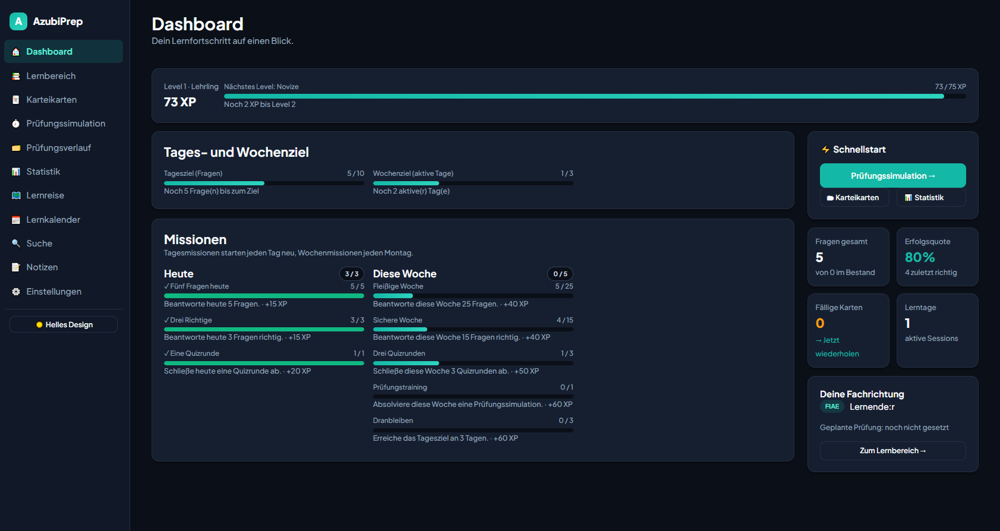 | 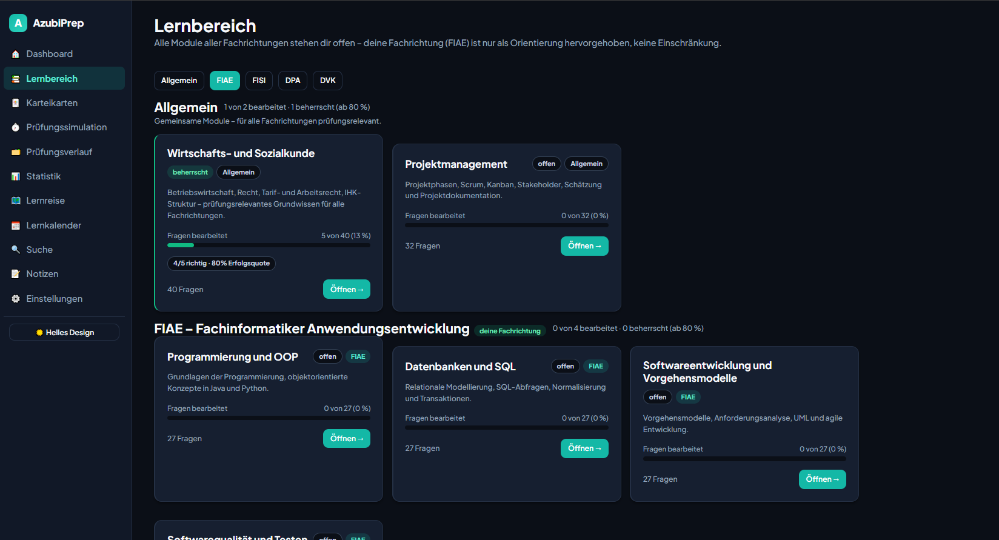 |
| **Dashboard** – XP, Tages-/Wochenziel, Missionen | **Lernbereich** – Module je Fachrichtung |
| 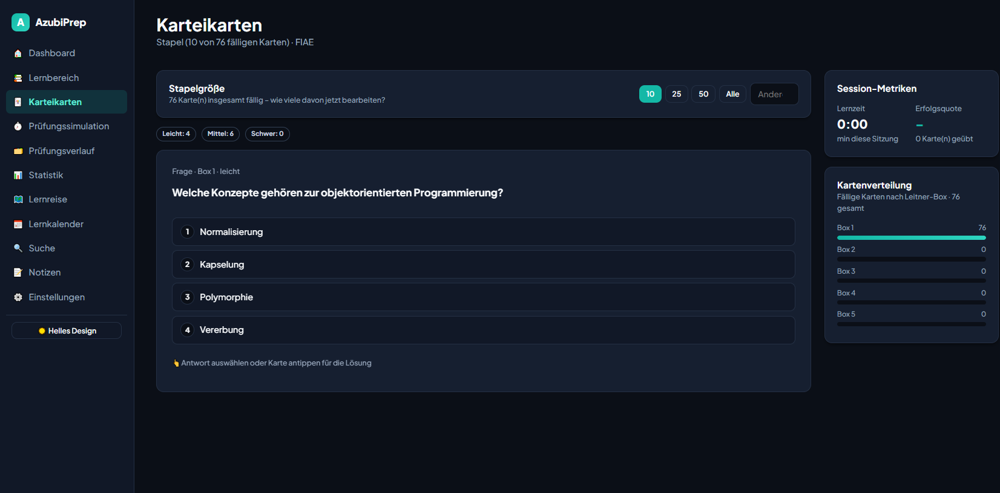 | 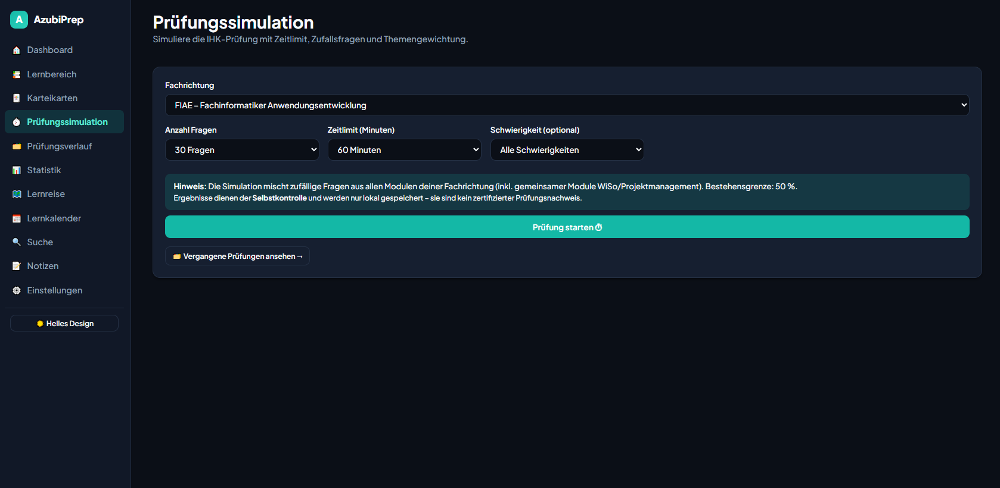 |
| **Karteikarten** – Leitner-System, Ziffern statt Buchstaben | **Prüfungssimulation** – Zeitlimit & Themengewichtung |
| 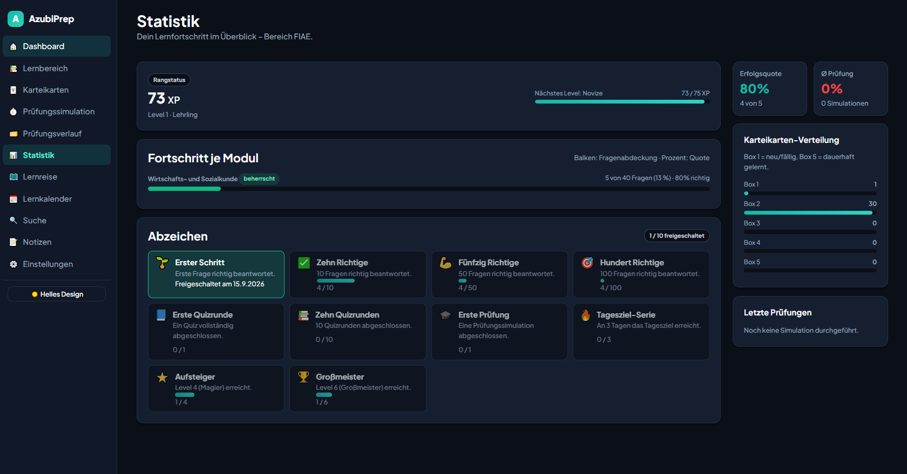 | 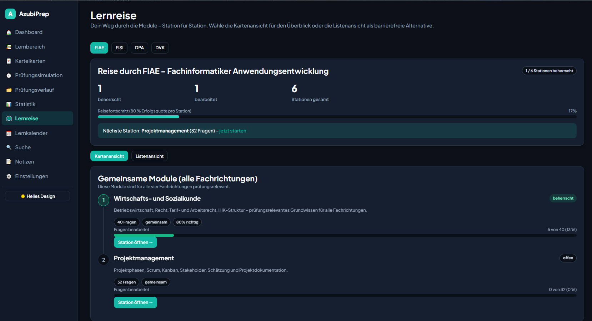 |
| **Statistik & Abzeichen** – Fortschritt & Gamification | **Lernreise** – Stationenweg durch die Module |
| 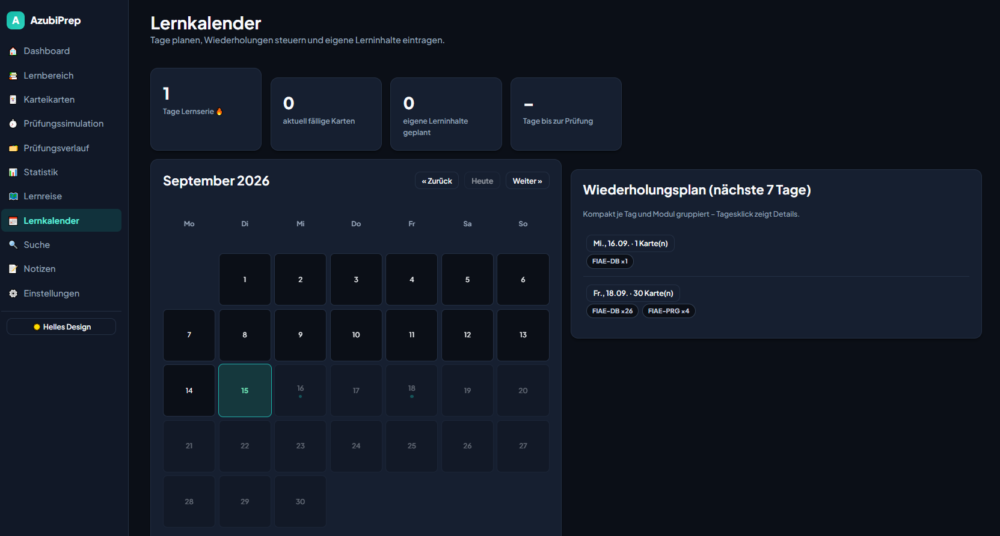 | 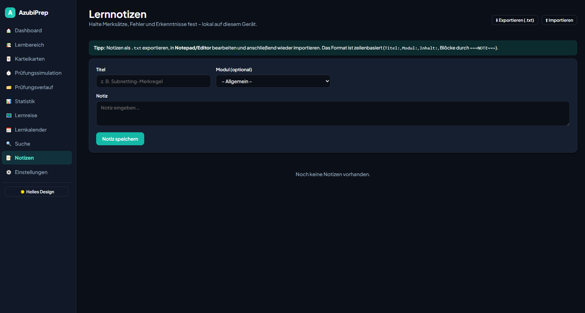 |
| **Lernkalender** – Wiederholungsplan & eigene Lerninhalte | **Lernnotizen** – lokal, export-/importierbar als `.txt` |
| 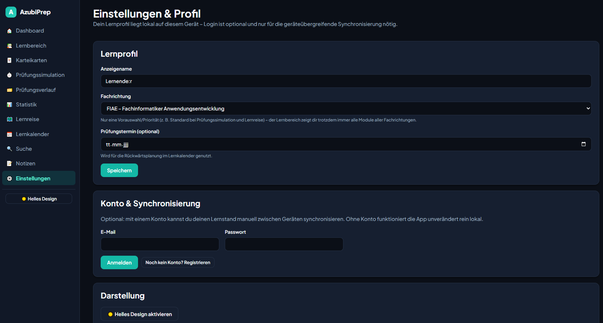 | |
| **Einstellungen & Profil** – Lernprofil, optionaler Konto-Sync, Darstellung | |

**Responsive** – jede Seite fällt auf schmalen Bildschirmen sauber auf eine Spalte zurück:

| | |
|---|---|
| 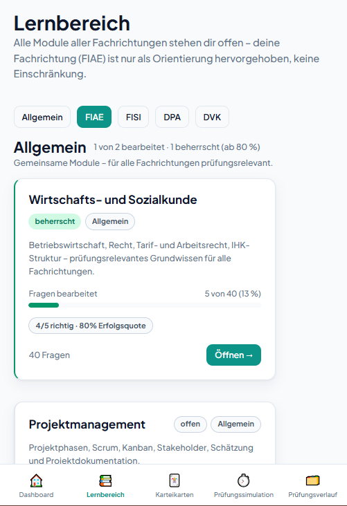 | 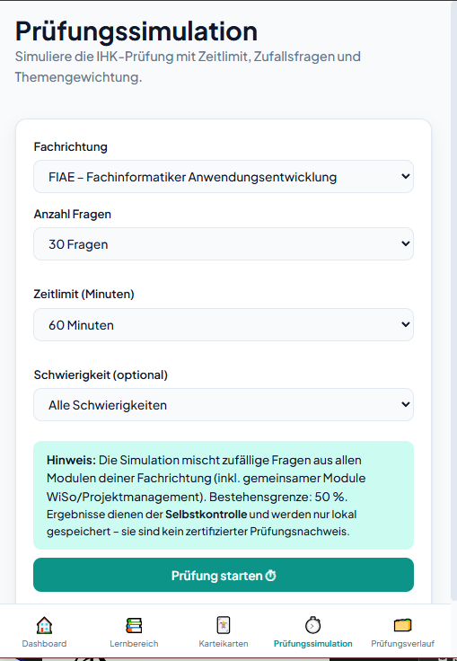 |
| **Lernbereich** (mobil, helles Design) | **Prüfungssimulation** (mobil, helles Design) |

## Funktionsumfang

**Lernen & Üben**
- Modulbasiertes Lernen mit Theorieblock je Modul
- Quizmodus mit Sofort-Feedback und Erklärung (Single-Choice, Multiple-Choice, Freitext)
- Karteikartenmodus mit Spaced Repetition (Leitner-System, 5 Boxen)
- Prüfungssimulation mit Zeitlimit, Zufallsfragen, Themengewichtung und Bestehensgrenze
- Volltextsuche über Fragen, Erklärungen, Themen und Module

**Fortschritt & Motivation**
- Lernfortschritt und Erfolgsquote je Modul und Fragetyp
- Prüfungsverlauf mit Frage-für-Frage-Review (eigene Antwort vs. richtige Antwort)
- Lernkalender mit Lernserie, Wiederholungsplan und eigenen Lerninhalten
- Lernreise als Stationenweg (gemeinsame Module zuerst, danach die eigene Fachrichtung)
- XP-System, Levels, Missionen und Abzeichen
- Lernnotizen, lokal gespeichert und als `.txt` export-/importierbar

**Konto & Sync (optional)**
- Registrierung/Login mit Passwort-Komplexitätsprüfung (in den Einstellungen)
- Lernstand manuell hoch-/herunterladen, um ihn zwischen mehreren Geräten
  abzugleichen (Last-Write-Wins, kein automatischer Hintergrund-Sync)
- Ohne Konto läuft die App unverändert rein lokal weiter

**Technik**
- Überarbeitetes visuelles Design (Dark Mode in warmem Anthrazit statt
  reinem Schwarz, Teal als Primärfarbe, gut lesbare Typografie – siehe
  [`docs/04-UI-UX.md`](docs/04-UI-UX.md))
- Dark/Light Mode, responsives Layout (Desktop-Sidebar + Mobile-Navigation)
- Installierbare PWA mit Offline-Unterstützung (Service Worker)
- Zusätzlich als native Windows-Desktop-App (Electron) verfügbar
- Sicherheitsgehärtetes Backend: Security-Header (Helmet/CSP/HSTS), Rate-Limiting, geschützter Admin-Reload
- Inhalte pflegbar über Excel/CSV, ohne Codeänderung

## Tech-Stack

| Bereich | Technologie |
|---|---|
| Frontend | React 18 + Vite, React Router |
| Backend | Node.js + Express (zustandslose Content-API) |
| Desktop | Electron (Hülle um dasselbe Backend/Frontend) |
| Inhalte | Excel/CSV (`content/`), Theorie als Markdown |
| Persistenz | Lernstand standardmäßig in `localStorage`; optional PostgreSQL für Konto/Geräte-Sync |
| Auth | bcrypt-Passwort-Hashing + JWT (nur bei optionalem Konto) |
| PWA | Web App Manifest + Service Worker |
| Sicherheit | Helmet (CSP/HSTS/Frame-Options), eigenes Rate-Limiting |

## Schnellstart (Web-App)

Voraussetzung: **Node.js ≥ 20**

```bash
# 1) Backend starten (Port 3001)
cd backend
npm install
npm start

# 2) Frontend im Dev-Modus (Port 5173, Proxy auf /api)
cd frontend
npm install
npm run dev
```

Produktions-Build (Frontend bauen, Backend liefert `dist/` mit aus):

```bash
cd frontend && npm run build
cd ../backend && npm start   # http://localhost:3001
```

## Desktop-App (Electron)

AzubiPrep läuft wahlweise auch als installierbare Windows-Desktop-App – eine
Electron-Hülle um dasselbe Backend und Frontend, ohne separaten Code-Pfad:

```bash
cd desktop
npm install
npm start        # startet die App im eigenen Fenster

npm run dist      # baut die Windows-Installer-Datei (Setup.exe) nach desktop/dist/
```

## Inhalte pflegen (ohne Code)

Alle Fragen liegen als **CSV-Dateien** in `content/questions/` (eine Datei je
Modul) – direkt in Excel bearbeitbar (UTF-8, Trennzeichen `;`). Nach dem
Bearbeiten Backend neu starten oder `POST /api/admin/reload` aufrufen.

- `content/fachrichtungen.csv` – Fachrichtungen
- `content/modules.csv` – Modul-Stammdaten
- `content/questions/<modul_id>.csv` – Fragen je Modul
- `content/theorie/<modul_id>.md` – Theorieblöcke je Modul

## Projektstruktur

```
AzubiPrep/
├── content/            Inhalte (Excel/CSV, Markdown – kein Code)
│   ├── fachrichtungen.csv
│   ├── modules.csv
│   ├── questions/*.csv     18 Dateien (eine je Modul)
│   └── theorie/*.md        18 Theorie-Dateien
├── backend/            Node.js + Express (zustandslose Content-API)
│   ├── src/                 server, app, config, content, csv,
│   │                        answer, exam, sicherheit, routes/
│   └── scripts/             validate-content · repair-ft-rows ·
│                            content-statistik · sicherheits-check
├── frontend/           React + Vite (PWA)
│   └── src/                 pages, components, store, api, context, utils
├── desktop/            Electron-Hülle für die Windows-Desktop-App
├── screenshots/        App-Screenshots für dieses README
├── docs/               Produktvision, Architektur, API-Referenz,
│                       Sicherheitskonzept, Projektstatus u. v. m.
├── ORCHESTRATOR.md     Agenten-Workflow (Task-Briefs + Review)
└── AGENTS.md           Konventionen für alle Agenten
```

## Dokumentation

Unter [`docs/`](docs/): Produktvision, Lernkonzept, Fachrichtungen,
Datenformate, API-Referenz, Architektur, PWA-Konzept, Sicherheitskonzept,
Scrum-Planung, Gamification u. v. m. – Einstieg über
[`docs/00-Start.md`](docs/00-Start.md).

## Projektstand & Roadmap

Kompakte, laufend aktualisierte Statusübersicht (Kennzahlen, verifizierter
Stand, offene Punkte): [`docs/PROJEKTSTATUS.md`](docs/PROJEKTSTATUS.md).
Die tagesaktuelle Task-Liste (was offen ist, was erledigt ist) führt
[`docs/agent-briefs/STATUS.md`](docs/agent-briefs/STATUS.md) bzw.
[`docs/agent-briefs/DONE.md`](docs/agent-briefs/DONE.md).

Offene Punkte mit höchster Priorität:
- Installierten Windows-Installer real durchtesten (Installation, App-Start, Klicktest)
- Fachlicher Inhalts-Review der Fragen durch Fachkundige je Fachrichtung (KI-Review der ursprünglichen 500 ist erfolgt, 1123 neu importierte Fragen aus dem Zusatz-Fragenkatalog stehen noch aus)

Weitere offene Punkte: UX-Feinschliff nach weiterem Nutzerfeedback,
Push-Benachrichtigungen, Autoren-Weboberfläche statt Excel/CSV-Pflege,
KI-Integration prüfen, Windows-Installer signieren.

## Autor

Entwickelt von **Sven Weyers** ([@CharlyCheese](https://github.com/CharlyCheese)).

## Lizenz

Veröffentlicht unter der [MIT-Lizenz](LICENSE) – Weiterverwendung ist
erlaubt, der Copyright-Hinweis und der Lizenztext müssen dabei erhalten
bleiben.
